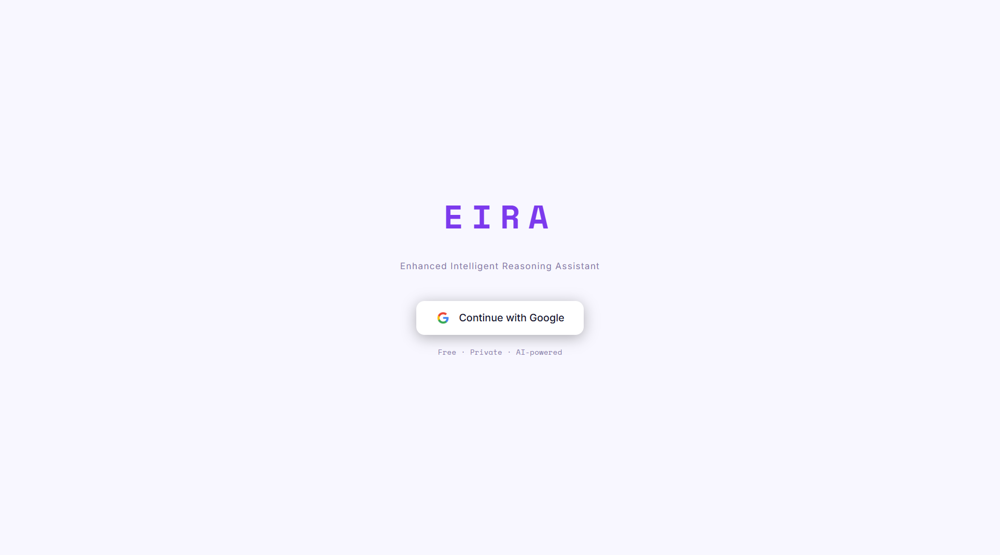
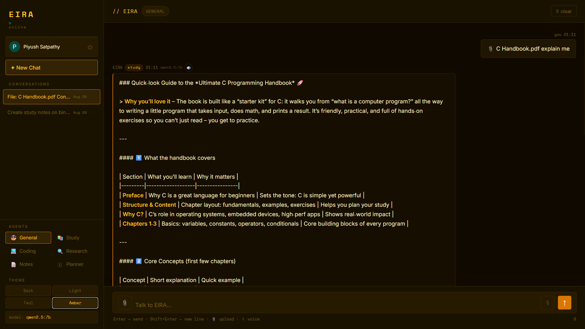
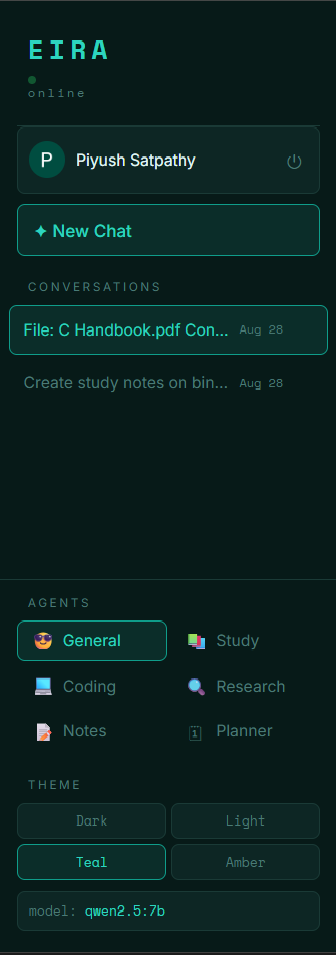
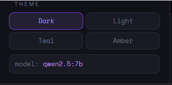
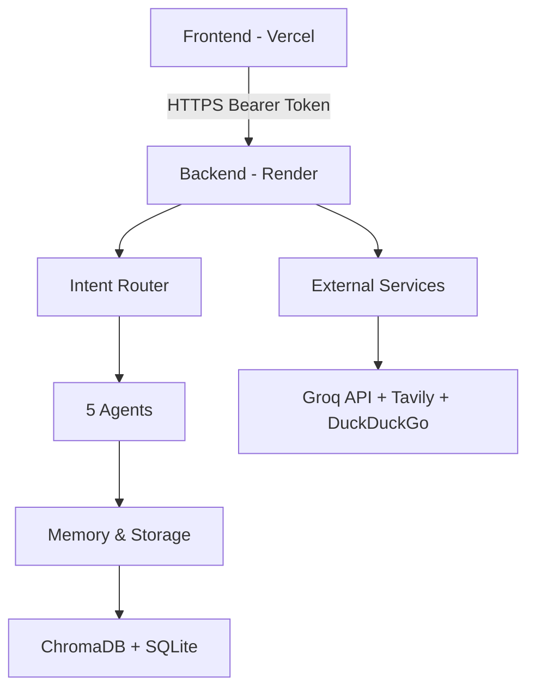

# EIRA — Multi-Agent AI Assistant


**An AI-powered assistant with 5 specialized agents, semantic memory, voice support, and file processing. Deployed and live.**

## 🚀 Live Demo

| Service | URL |
|---------|-----|
| **Frontend** | [eira-coral.vercel.app](https://eira-coral.vercel.app) |
| **Backend API** | [eira-backend-v2.onrender.com/docs](https://eira-backend-v2.onrender.com/docs) |

## 📸 Screenshots

| Login | Chat |
|-------|------|
|  |  |

| Agents | Themes |
|--------|--------|
|  |  |

## ✨ Features

- 🤖 **5 Specialized Agents** — Study, Coding, Research, Notes, Planner
- 🧠 **Semantic Memory (RAG)** — ChromaDB vector storage, cross-session context
- 🎙 **Voice Input/Output** — Web Speech API (STT + TTS with female voice)
- 📎 **File Upload** — PDF, DOCX, TXT, code files (text extraction)
- 🔐 **Google Authentication** — Firebase Auth, per-user data isolation
- 💾 **Session Management** — SQLite-based chat history
- 🔍 **Web Search** — Tavily + DuckDuckGo fallback
- 🎨 **4 Themes** — Dark, Light, Teal, Amber
- 📱 **Responsive UI** — Works on mobile & desktop

## 🛠 Tech Stack

| Layer | Technologies |
|-------|-------------|
| **Frontend** | HTML5, CSS3, JavaScript (Vanilla), Firebase SDK |
| **Backend** | FastAPI, Python 3.11, Uvicorn |
| **AI/ML** | Groq API (GPT-OSS-20B), Ollama (Qwen2.5, DeepSeek-Coder), Sentence Transformers |
| **Vector DB** | ChromaDB |
| **Database** | SQLite |
| **Auth** | Firebase Authentication (Google Sign-In) |
| **Search** | Tavily API, DuckDuckGo (ddgs) |
| **Deployment** | Vercel (frontend), Render (backend) |
| **Monitoring** | UptimeRobot (cold-start prevention) |

## 🏗 Architecture



## 🧠 How Memory Works (RAG)

1. User sends message
2. Message embedded using `sentence-transformers`
3. Semantic search in ChromaDB finds relevant past context
4. Context injected into system prompt
5. EIRA responds with memory-aware answer

```python
def get_relevant_memory(query: str, n_results: int = 3) -> str:
    results = collection.query(
        query_texts=[query],
        n_results=min(n_results, collection.count())
    )
    return results["documents"][0]
```

## 🚀 Quick Start

### Backend (Render)

```bash
uvicorn api.main:app --host 0.0.0.0 --port $PORT
```

### Frontend (Vercel)

Set `Root Directory` to `dashboard`, deploy `index.html`.

## 📝 License

MIT License — free to use and learn from.

---

**Built with 🧠 by Piyush Satpathy**  
*2nd Year CSE, GITA Autonomous College, Bhubaneswar*